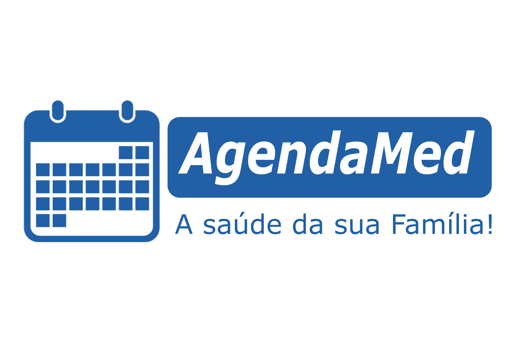

# AgendaMed
  
O **AgendaMed** é um sistema feito para as Unidades Básicas de Saúde do município de Araras, que tem foco em melhorar a qualidade no agendamento de consultas. 
É do planejamento reduzir a necessidade de filas para realizar um único agendamento.
  
Com isso, o projeto se baseia em um site que possibita às pessoas utilizadoras desse serviço público a agendarem consultas diretamente pela internet. 
Desta forma, o objetivo é obter automatização do que era feito em torno de documentos papelados e, consequentemente, resolução do amontoamento de papéis permitindo circulação do estabelecimento.
  
Palavras-chaves: Saúde, UBS, agendamento, consulta, Araras, serviço público.

## Tecnologias ##

O projeto utiliza, em sua conjuntura:
  * HTML, CSS e JavaScripit;
  * PHP;
  * MySQL.
 
Outros softwares como Astah foram utilizados para completar todas as fases do projeto.

## Screenshots ##

_Nomes fictícios_

# TROLLS #

A equipe de desenvolvimento *TROLLS* é composta por:
LEANDRO APARECIDO DE SOUZA   
PAULA THAMYRES DA SILVA 
RAFAEL LUIZ FEMINA 
WELLINGTON RODRIGO FRANCO 
JOSÉ ERINALDO DE JESUS MARTINS

